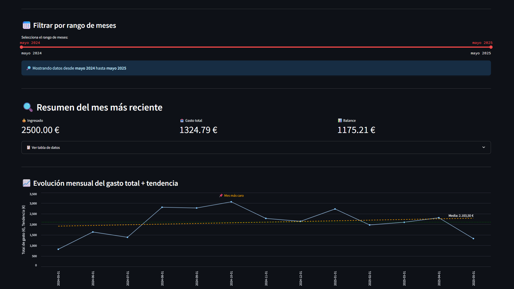
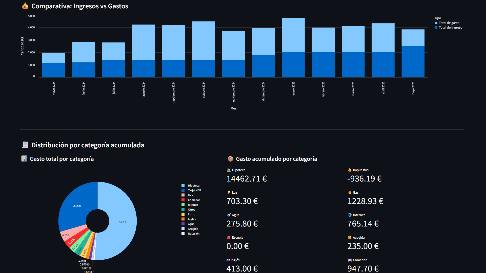
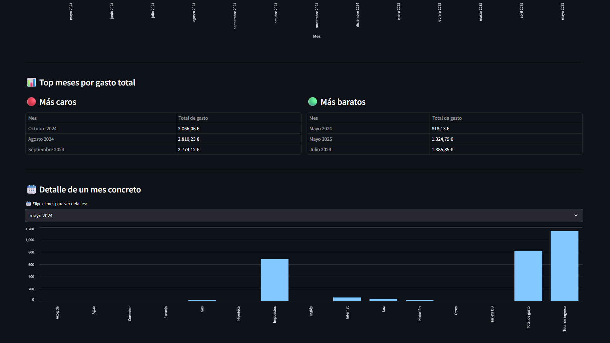

# 📊 Expenses Dashboard - Streamlit

A visual and interactive dashboard built with Streamlit to track and analyze monthly household expenses based on an Excel file. The dashboard provides filters, summaries, category-based analysis, and the ability to export data and a PDF report.

## 🧩 Features

- Import Excel file with monthly data
- Select month range to analyze
- Monthly summary with income, expenses and balance
- Visual charts: trend line, pie chart by category, bar chart for income vs expenses
- Auto-alerts if you have consecutive negative balances
- Identify most expensive and cheapest months
- Detailed view by month
- CSV and PDF export

## 📁 Project Structure

```
expenses_dashboard/
├── app.py
├── utils.py
├── style.css
├── assets/
│ ├── main_view.png
│ ├── trend_view.png
│ └── categories_view.png
├── data/
│ └── expenses_template.xlsx
├── .gitignore
├── LICENSE
└── README.md
```

## 🚀 Getting Started

1. **Clone this repository**

```bash
git clone https://github.com/J1Ejota/expenses_dashboard.git
cd expenses_dashboard
```

2. Create a virtual environment (optional but recommended):

```bash
python -m venv venv
source venv/bin/activate  # On Windows: venv\Scripts\activate
```

3. Install the dependencies

```bash
pip install -r requirements.txt
```

4. Run the app

```bash
streamlit run app.py
```

## 📊 Excel Format (expenses_template.xlsx)

The dashboard expects an Excel file with monthly data using the following column names (in Spanish):

Columna (Español) -- Description (English)

---

```scss
Mes             — Month (e.g., abril 2024)
Hipoteca        — Mortgage
Impuestos       — Taxes
Luz             — Electricity
Gas             — Gas
Agua            — Water
Internet        — Internet
Escuela         — School
Acogida         — After-school care
Inglés          — English lessons
Comedor         — School lunch
Natación        — Swimming
Tarjeta DB      — Credit card (debit)
Otros           — Other expenses
Ingresado a cuenta — Income
Balance         — Auto-calculated (optional)
```

---

You can duplicate expenses_template.xlsx for your own use and enter your real data.

## 📌 Notes

All data is stored and processed locally. Nothing is uploaded or shared.

The .env file (if used in future versions) should be excluded with .gitignore.

You can fully customize the categories and visual layout to suit your needs.

## 📷 Screenshots

**🏠 Main Dashboard**  
Provides a complete overview of your most recent month, including income, expenses, and balance, with alerts and quick stats.



---

**📦 Category Breakdown**  
Displays your total spending by category using a pie chart and visual metric cards.



---

**📈 Trend & Balance Analysis**  
Shows spending trends and balance changes month by month, highlighting the most expensive periods.



## 📜 License

This project is licensed under the MIT License — see the LICENSE file for details.
